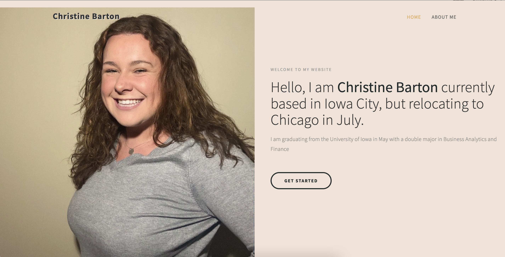

# Portfolio Website
> I created a portfolio website that comes from an online template and contains one main html page title index.html.

## Table of Contents
* [General Info](#general-information)
* [Technologies Used](#technologies-used)
* [Features](#features)
* [Final Result](#final-result)
* [Setup](#setup)
* [Usage](#usage)
* [Project Status](#project-status)
<!-- * [License](#license) -->

## General Information
- I created a website for myself so it is easier to find me and what I do. 
- The purpose of the project was to have a place I can put my work and have links to my other professional accounts. 

## Technologies Used
- HTML/CSS
- Microsoft Azure 

## Features

- 1. A website you are able to scroll
- 2. Website works and looks good on any device
- 3. You can visit my GitHub and LinkedIn from website

## Final Result

## Setup
Microsoft Azure Web Services

You need a place to be able to edit html and css files. I used Visual Studio Code. You would start with finding a template online and downloading it. Then editing the information to be your own. Then uploading all of this to your own GitHub and creating a Static Web App on Azure to go with it. You can use the link they give you or use your own domain by creating it on namecheap. If you get a domain you then need to link up your domain with the web service app. 

## Usage
Someone could use it to see how to build a website and connect a domain link to it. You could download the template I have in the GitHub by downloading all the files and filling in the information with your own.

## Project Status
Project is: _complete_
